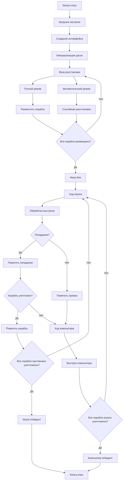

# Морской бой на Python с Tkinter

<div align="center">


Классическая игра "Морской бой" с графическим интерфейсом

</div>

## 📋 Содержание
- [Описание](#описание)
- [Особенности](#особенности)
- [Скриншоты](#скриншоты)
- [Структура кода](#структура-кода)
- [Код](#код)

## 🎯 Описание

**Морской бой** - это полноценная реализация классической настольной игры с графическим интерфейсом на Python. Игра позволяет сразиться против компьютера с интуитивно понятным управлением и визуализацией игрового процесса.

## Особенности

### Игровые возможности
- ✅ Полноценный игровой цикл с пошаговой механикой
- ✅ Два режима расстановки кораблей (ручной/автоматический)
- ✅ Интеллектуальная система ходов компьютера
- ✅ Визуальное отображение состояния кораблей
- ✅ Определение уничтожения кораблей

### 🎨 Интерфейс
- ✅ Цветовая кодировка всех элементов
- ✅ Интерактивная подсветка при размещении
- ✅ Панель легенды с пояснениями
- ✅ Центрированное расположение элементов
- ✅ Адаптивная кнопка "В бой!"

### ⚙️ Функциональность
- ✅ Поворот кораблей клавишей `R`
- ✅ Валидация размещения кораблей
- ✅ Автоматическая расстановка компьютера
- ✅ Проверка условий победы
- ✅ Возможность новой игры без перезапуска

## 📸 Скриншоты

### Игровой интерфейс


## Структура кода



## Код

#### ИМПОРТ БИБЛИОТЕК
```c
import tkinter as tk
from tkinter import messagebox
import random
```
### НАСТРОЙКИ ИГРЫ (КОНСТАНТЫ)
```c
BOARD_SIZE = 10          # Размер игрового поля (10x10 клеток)
CELL_SIZE = 30           # Размер одной клетки в пикселях
```
### Размеры кораблей (классические правила морского боя)
```c
ships = [4, 3, 3, 2, 2, 2, 1, 1, 1, 1]
```
### Названия кораблей для отображения пользователю
```c
ship_names = [
    "Линкор (4)",
    "Крейсер (3)",
    "Крейсер (3)",
    "Эсминец (2)",
    "Эсминец (2)",
    "Эсминец (2)",
    "Катер (1)",
    "Катер (1)",
    "Катер (1)",
    "Катер (1)"
]
```
### ЦВЕТОВАЯ СХЕМА ИГРЫ
```c
COLOR_EMPTY = "light blue"      # Цвет пустой клетки (вода)
COLOR_GRID = "black"            # Цвет сетки
COLOR_SHIP = "blue"             # Цвет корабля игрока
COLOR_HOVER = "green"           # Цвет предпросмотра при размещении
COLOR_MISS = "white"            # Цвет промаха
COLOR_DESTROYED = "darkred"     # Цвет уничтоженного корабля
```
### СОЗДАНИЕ ГЛАВНОГО ОКНА ПРИЛОЖЕНИЯ
```c
root = tk.Tk()
root.title("Морской бой")
root.geometry("1050x950")
```
### СОЗДАНИЕ И РАЗМЕЩЕНИЕ ВИДЖЕТОВ ИНТЕРФЕЙСА
#### Основной фрейм для центровки
```c
main_frame = tk.Frame(root, bg="lightgray")
main_frame.pack(expand=True)
```
####Доска игрока (левая часть)
```c
player_frame = tk.Frame(main_frame, bg="lightgray")
player_frame.grid(row=0, column=0, padx=50, pady=10)

player_label = tk.Label(
    player_frame,
    text="Ваша доска",
    font=("Arial", 14, "bold")
)
player_label.pack(pady=5)

current_ship_label = tk.Label(
    player_frame,
    text="Ставим: Линкор (4)",
    font=("Arial", 12, "bold")
)
current_ship_label.pack(pady=5)

player_canvas = tk.Canvas(
    player_frame,
    width=BOARD_SIZE * CELL_SIZE + 1,
    height=BOARD_SIZE * CELL_SIZE + 1,
    bg=COLOR_EMPTY,
    highlightthickness=0
)
player_canvas.pack(pady=5)
```
#### Доска компьютера (правая часть)
```c
computer_frame = tk.Frame(main_frame, bg="lightgray")
computer_frame.grid(row=0, column=1, padx=50, pady=10)

computer_label = tk.Label(
    computer_frame,
    text="Доска компьютера",
    font=("Arial", 14, "bold")
)
computer_label.pack(pady=5)

computer_canvas = tk.Canvas(
    computer_frame,
    width=BOARD_SIZE * CELL_SIZE + 1,
    height=BOARD_SIZE * CELL_SIZE + 1,
    bg=COLOR_EMPTY,
    highlightthickness=0
)
computer_canvas.pack(pady=5)
```
#### Фрейм для кнопок управления
```c
button_frame = tk.Frame(root, bg="lightgray")
button_frame.pack(pady=10)
```
### ГЛОБАЛЬНЫЕ ПЕРЕМЕННЫЕ ДЛЯ ХРАНЕНИЯ СОСТОЯНИЯ ИГРЫ
```c
player_board = []
computer_board = []
manual_index = 0
manual_direction = "H"
hover_rects = []
game_started = False
```
#### ФУНКЦИИ ИГРЫ
```c
def create_empty_board():
    """
    Создает пустое игровое поле.
    
    Returns:
        list: Двумерный список BOARD_SIZE x BOARD_SIZE, заполненный нулями
    """
    return [[0] * BOARD_SIZE for _ in range(BOARD_SIZE)]

def can_place_ship(board, row, col, size, direction):
    """
    Проверяет возможность размещения корабля на доске.
    
    Args:
        board (list): Игровая доска
        row (int): Начальная строка
        col (int): Начальный столбец
        size (int): Размер корабля
        direction (str): Направление ("H" - горизонтально, "V" - вертикально)
    
    Returns:
        bool: True если можно разместить, иначе False
    """
    for i in range(size):
        r = row + i if direction == "V" else row
        c = col + i if direction == "H" else col
        
        # Проверка выхода за границы доски
        if r >= BOARD_SIZE or c >= BOARD_SIZE:
            return False
        
        # Проверка соседних клеток
        for dr in [-1, 0, 1]:
            for dc in [-1, 0, 1]:
                nr = r + dr
                nc = c + dc
                if 0 <= nr < BOARD_SIZE and 0 <= nc < BOARD_SIZE and board[nr][nc] != 0:
                    return False
    return True

def draw_grid(canvas, board, show_ships=False):
    """
    Отрисовывает игровую доску на Canvas.
    
    Args:
        canvas: Canvas виджет для отрисовки
        board (list): Игровая доска
        show_ships (bool): Показывать ли корабли
    """
    canvas.delete("all")
    
    # Отрисовка сетки
    for i in range(BOARD_SIZE + 1):
        x = i * CELL_SIZE
        y = i * CELL_SIZE
        canvas.create_line(x, 0, x, BOARD_SIZE * CELL_SIZE, fill=COLOR_GRID)
        canvas.create_line(0, y, BOARD_SIZE * CELL_SIZE, y, fill=COLOR_GRID)
    
    # Отрисовка кораблей (если нужно)
    if show_ships:
        for r in range(BOARD_SIZE):
            for c in range(BOARD_SIZE):
                if board[r][c] == 1:  # Корабль
                    x1 = c * CELL_SIZE
                    y1 = r * CELL_SIZE
                    x2 = x1 + CELL_SIZE
                    y2 = y1 + CELL_SIZE
                    canvas.create_rectangle(x1, y1, x2, y2, fill=COLOR_SHIP)
    
    # Отрисовка попаданий и промахов
    for r in range(BOARD_SIZE):
        for c in range(BOARD_SIZE):
            if board[r][c] == 2:  # Попадание
                draw_hit(canvas, r, c)
            elif board[r][c] == 3:  # Промах
                x1 = c * CELL_SIZE
                y1 = r * CELL_SIZE
                x2 = x1 + CELL_SIZE
                y2 = y1 + CELL_SIZE
                canvas.create_rectangle(x1, y1, x2, y2, fill=COLOR_MISS)
            elif board[r][c] == 4:  # Уничтоженный корабль
                x1 = c * CELL_SIZE
                y1 = r * CELL_SIZE
                x2 = x1 + CELL_SIZE
                y2 = y1 + CELL_SIZE
                canvas.create_rectangle(x1, y1, x2, y2, fill=COLOR_DESTROYED)

def update_hover(event):
    """
    Обновляет предпросмотр размещения корабля при движении мыши.
    
    Args:
        event: Событие движения мыши
    """
    global hover_rects
    
    # Удаляем старые прямоугольники предпросмотра
    for rect in hover_rects:
        player_canvas.delete(rect)
    hover_rects.clear()
    
    if manual_index >= len(ships):
        return
    
    # Определяем клетку под курсором
    row = event.y // CELL_SIZE
    col = event.x // CELL_SIZE
    size = ships[manual_index]
    
    # Если можно разместить - отображаем предпросмотр
    if can_place_ship(player_board, row, col, size, manual_direction):
        for i in range(size):
            r = row + i if manual_direction == "V" else row
            c = col + i if manual_direction == "H" else col
            
            x1 = c * CELL_SIZE
            y1 = r * CELL_SIZE
            x2 = x1 + CELL_SIZE
            y2 = y1 + CELL_SIZE
            
            # Создаем полупрозрачный прямоугольник
            rect = player_canvas.create_rectangle(
                x1, y1, x2, y2, 
                fill=COLOR_HOVER, 
                stipple="gray50"  # Эффект полупрозрачности
            )
            hover_rects.append(rect)

def player_click(event):
    """
    Обрабатывает клик игрока при размещении кораблей.
    
    Args:
        event: Событие клика мыши
    """
    global manual_index
    
    if manual_index >= len(ships):
        messagebox.showinfo("Готово", "Все корабли размещены!")
        return
    
    row = event.y // CELL_SIZE
    col = event.x // CELL_SIZE
    size = ships[manual_index]
    
    if can_place_ship(player_board, row, col, size, manual_direction):
        # Размещаем корабль на доске
        for i in range(size):
            r = row + i if manual_direction == "V" else row
            c = col + i if manual_direction == "H" else col
            player_board[r][c] = 1
        
        manual_index += 1
        draw_grid(player_canvas, player_board, True)
        
        if manual_index < len(ships):
            current_ship_label.config(text=f"Ставим: {ship_names[manual_index]}")
        else:
            current_ship_label.config(text="Все корабли размещены!")
    else:
        messagebox.showwarning("Ошибка", "Невозможно разместить корабль здесь")

def key_press(event):
    """
    Обрабатывает нажатие клавиш.
    Клавиша R меняет направление корабля.
    
    Args:
        event: Событие нажатия клавиши
    """
    global manual_direction
    if event.keysym.lower() == "r":
        manual_direction = "V" if manual_direction == "H" else "H"

def clear_board():
    """
    Очищает доску игрока и сбрасывает состояние размещения.
    """
    global manual_index, manual_direction
    player_board[:] = create_empty_board()
    manual_index = 0
    manual_direction = "H"
    current_ship_label.config(text=f"Ставим: {ship_names[manual_index]}")
    draw_grid(player_canvas, player_board, True)

def place_ship(board, size):
    """
    Случайно размещает один корабль на доске.
    
    Args:
        board (list): Игровая доска
        size (int): Размер корабля
    """
    while True:
        direction = random.choice(["H", "V"])
        row = random.randint(0, BOARD_SIZE - 1)
        col = random.randint(0, BOARD_SIZE - 1)
        
        if can_place_ship(board, row, col, size, direction):
            for i in range(size):
                r = row + i if direction == "V" else row
                c = col + i if direction == "H" else col
                board[r][c] = 1
            break

def place_ships_randomly(board):
    """
    Случайно размещает все корабли на доске.
    
    Args:
        board (list): Игровая доска
    """
    for ship_size in ships:
        place_ship(board, ship_size)

def draw_hit(canvas, row, col):
    """
    Рисует крестик в клетке при попадании.
    
    Args:
        canvas: Canvas виджет
        row (int): Строка клетки
        col (int): Столбец клетки
    """
    padding = 5
    x1 = col * CELL_SIZE + padding
    y1 = row * CELL_SIZE + padding
    x2 = (col + 1) * CELL_SIZE - padding
    y2 = (row + 1) * CELL_SIZE - padding
    
    canvas.create_line(x1, y1, x2, y2, fill="red", width=2)
    canvas.create_line(x1, y2, x2, y1, fill="red", width=2)

def count_ships(board):
    """
    Подсчитывает количество неподбитых клеток кораблей.
    
    Args:
        board (list): Игровая доска
    
    Returns:
        int: Количество неподбитых клеток
    """
    return sum(cell == 1 for row in board for cell in row)

def mark_destroyed(board, row, col):
    """
    Помечает все клетки уничтоженного корабля.
    
    Args:
        board (list): Игровая доска
        row (int): Строка попадания
        col (int): Столбец попадания
    
    Returns:
        list: Список клеток уничтоженного корабля
    """
    visited = set()
    
    def dfs(r, c):
        """Поиск в глубину для нахождения всех клеток корабля."""
        if (r, c) in visited:
            return []
        visited.add((r, c))
        cells = [(r, c)]
        
        for dr, dc in [(0, 1), (1, 0), (0, -1), (-1, 0)]:
            nr = r + dr
            nc = c + dc
            if 0 <= nr < BOARD_SIZE and 0 <= nc < BOARD_SIZE and board[nr][nc] in [1, 2]:
                cells += dfs(nr, nc)
        
        return cells
    
    ship_cells = dfs(row, col)
    
    # Помечаем все клетки корабля как уничтоженные
    for r, c in ship_cells:
        board[r][c] = 4
    
    return ship_cells

def computer_turn():
    """Ход компьютера."""
    while True:
        # Выбираем случайную клетку из необстрелянных
        candidates = [
            (r, c) for r in range(BOARD_SIZE) 
            for c in range(BOARD_SIZE) 
            if player_board[r][c] in [0, 1]
        ]
        
        if not candidates:
            return
        
        row, col = random.choice(candidates)
        cell = player_board[row][col]
        
        if cell == 1:  # Попадание
            player_board[row][col] = 2
            draw_grid(player_canvas, player_board, True)
            
            if check_ship_destroyed(player_board, row, col):
                mark_destroyed(player_board, row, col)
                draw_grid(player_canvas, player_board, True)
                messagebox.showinfo("Внимание!", "Компьютер уничтожил ваш корабль!")
            
            if count_ships(player_board) == 0:
                messagebox.showinfo("Поражение", "Компьютер победил!")
        else:  # Промах
            player_board[row][col] = 3
            draw_grid(player_canvas, player_board, True)
        break

def check_ship_destroyed(board, row, col):
    """
    Проверяет, уничтожен ли корабль.
    
    Args:
        board (list): Игровая доска
        row (int): Строка попадания
        col (int): Столбец попадания
    
    Returns:
        bool: True если корабль уничтожен
    """
    visited = set()
    
    def dfs(r, c):
        """Поиск в глубину для проверки состояния корабля."""
        if (r, c) in visited:
            return []
        visited.add((r, c))
        cells = [(r, c)]
        
        for dr, dc in [(0, 1), (1, 0), (0, -1), (-1, 0)]:
            nr = r + dr
            nc = c + dc
            if 0 <= nr < BOARD_SIZE and 0 <= nc < BOARD_SIZE and board[nr][nc] in [1, 2]:
                cells += dfs(nr, nc)
        
        return cells
    
    ship_cells = dfs(row, col)
    
    # Проверяем, все ли клетки корабля подбиты
    return all(board[r][c] == 2 for r, c in ship_cells)

def computer_board_click(event):
    """
    Обрабатывает клик по доске компьютера во время игры.
    
    Args:
        event: Событие клика мыши
    """
    global game_started
    
    if not game_started:
        return
    
    row = event.y // CELL_SIZE
    col = event.x // CELL_SIZE
    cell = computer_board[row][col]
    
    # Если уже стреляли в эту клетку
    if cell in [2, 3, 4]:
        return
    
    if cell == 1:  # Попадание
        computer_board[row][col] = 2
        draw_grid(computer_canvas, computer_board, False)
        
        if check_ship_destroyed(computer_board, row, col):
            mark_destroyed(computer_board, row, col)
            draw_grid(computer_canvas, computer_board, False)
            messagebox.showinfo("Убит!", "Вы уничтожили корабль противника!")
        
        if count_ships(computer_board) == 0:
            messagebox.showinfo("Победа", "Вы победили!")
            return
    else:  # Промах
        computer_board[row][col] = 3
        draw_grid(computer_canvas, computer_board, False)
        computer_turn()

def start_game():
    """
    Начинает игру после размещения всех кораблей.
    """
    global game_started
    
    if manual_index < len(ships):
        messagebox.showwarning("Ошибка", "Разместите все корабли перед боем!")
        return
    
    game_started = True
    
    # Отключаем размещение кораблей
    player_canvas.unbind("<Button-1>")
    player_canvas.unbind("<Motion>")
    
    current_ship_label.config(text="Игра началась! Стреляйте по доске компьютера.")
    
    # Включаем стрельбу по доске компьютера
    computer_canvas.bind("<Button-1>", computer_board_click)

def new_game():
    """
    Начинает новую игру.
    """
    global player_board, computer_board, manual_index, manual_direction, game_started
    
    # Сброс всех игровых переменных
    player_board = create_empty_board()
    computer_board = create_empty_board()
    manual_index = 0
    manual_direction = "H"
    game_started = False
    
    current_ship_label.config(text=f"Ставим: {ship_names[manual_index]}")
    
    # Отрисовка пустых досок
    draw_grid(player_canvas, player_board, True)
    draw_grid(computer_canvas, computer_board, False)
    
    # Сброс привязок событий
    computer_canvas.unbind("<Button-1>")
    player_canvas.bind("<Motion>", update_hover)
    
    # Случайное размещение кораблей компьютера
    place_ships_randomly(computer_board)

def auto_place():
    """
    Автоматическое размещение всех кораблей игрока.
    """
    global manual_index
    
    player_board[:] = create_empty_board()
    manual_index = len(ships)
    place_ships_randomly(player_board)
    draw_grid(player_canvas, player_board, True)
    current_ship_label.config(text="Все корабли размещены!")
```
### СОЗДАНИЕ КНОПОК УПРАВЛЕНИЯ
'''c
auto_button = tk.Button(
    button_frame, 
    text="Авторазмещение", 
    command=auto_place
)
auto_button.pack(side=tk.LEFT, padx=5)

manual_button = tk.Button(
    button_frame,
    text="Ручное размещение",
    command=lambda: player_canvas.bind("<Button-1>", player_click)
)
manual_button.pack(side=tk.LEFT, padx=5)

clear_button = tk.Button(
    button_frame,
    text="Очистить доску",
    command=clear_board
)
clear_button.pack(side=tk.LEFT, padx=5)

battle_button = tk.Button(
    button_frame,
    text="В бой!",
    command=start_game
)
battle_button.pack(side=tk.LEFT, padx=5)

newgame_button = tk.Button(
    button_frame,
    text="Новая игра",
    command=new_game
)
newgame_button.pack(side=tk.LEFT, padx=5)
'''
### СОЗДАНИЕ ИНСТРУКЦИИ С ЦВЕТНЫМИ КВАДРАТИКАМИ
```c
instructions_frame = tk.Frame(root, bg="lightgray")
instructions_frame.pack(pady=10)

instructions_text = tk.Label(
    instructions_frame,
    text=(
        "Управление:\n"
        "- Ручная расстановка: клик по клетке\n"
        "- Поворот корабля: клавиша R\n"
        "- Авторасстановка: кнопка 'Авторасстановка'\n"
        "- Очистка доски: кнопка 'Очистить доску'\n"
        "- Начало игры: кнопка 'В бой!'\n\n"
        "Обозначения:\n"
    ),
    justify=tk.LEFT,
    font=("Arial", 11),
    bg="lightgray"
)
instructions_text.pack(anchor="w")
```
#### Легенда с цветовыми обозначениями
```c
legend = [
    ("Пустая клетка", COLOR_EMPTY),
    ("Ваш корабль", COLOR_SHIP),
    ("Силует текущего корабля", COLOR_HOVER),
    ("Попадание", "red"),
    ("Промах", COLOR_MISS),
    ("Уничтоженный корабль", COLOR_DESTROYED),
]

for text, color in legend:
    frame = tk.Frame(instructions_frame, bg="lightgray")
    frame.pack(anchor="w", pady=2)
    
    color_box = tk.Label(
        frame, 
        bg=color, 
        width=2, 
        height=1, 
        relief="ridge", 
        borderwidth=1
    )
    color_box.pack(side=tk.LEFT, padx=5)
    
    label = tk.Label(
        frame, 
        text=text, 
        bg="lightgray", 
        font=("Arial", 11)
    )
    label.pack(side=tk.LEFT)
```
### ИНИЦИАЛИЗАЦИЯ И ЗАПУСК ИГРЫ
```c
player_board = create_empty_board()
computer_board = create_empty_board()
place_ships_randomly(computer_board)

draw_grid(player_canvas, player_board, True)
draw_grid(computer_canvas, computer_board, False)

player_canvas.bind("<Motion>", update_hover)
root.bind("<Key>", key_press)

root.mainloop()
```