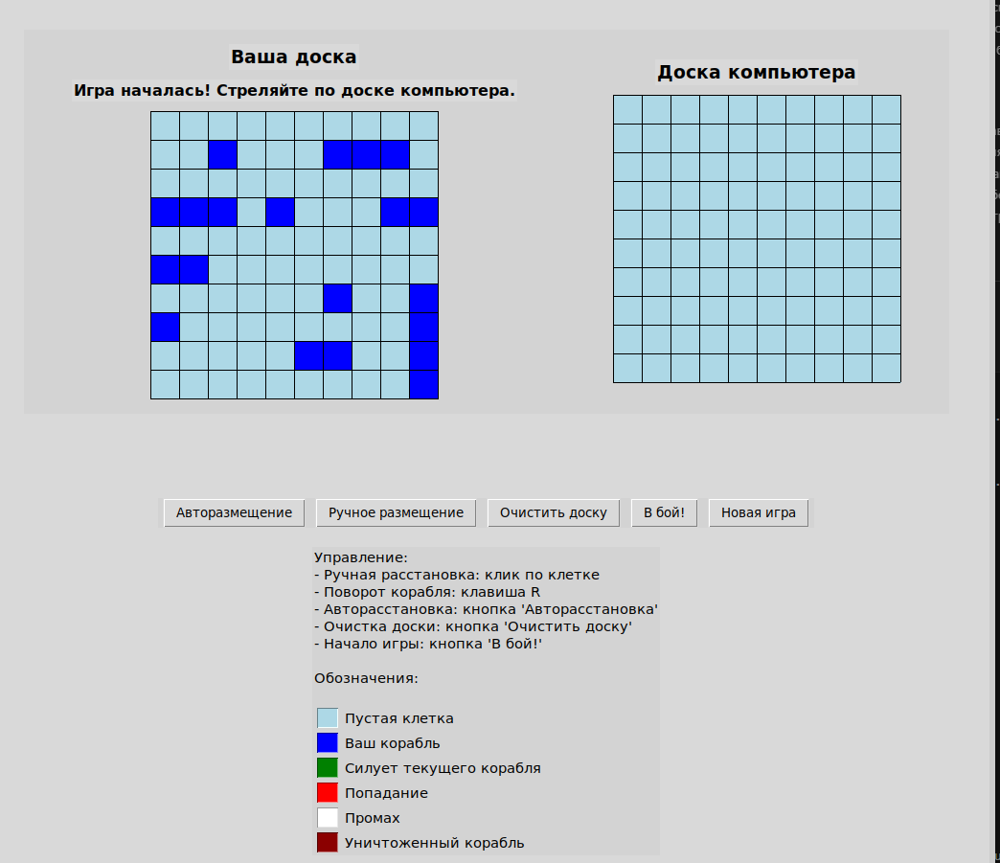
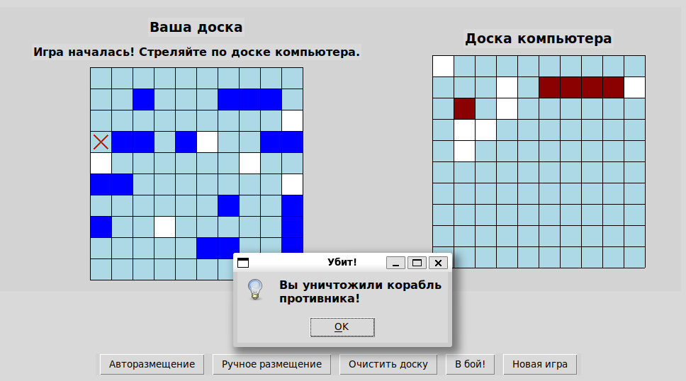
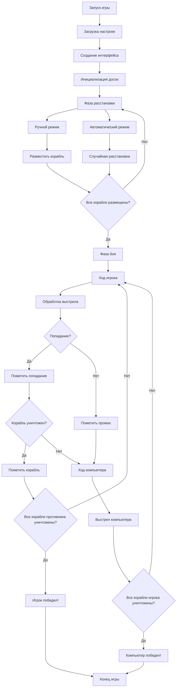

# Морской бой на Python с Tkinter

Классическая игра "Морской бой" с графическим интерфейсом

## 📋 Содержание
- [Описание](#описание)
- [Особенности](#особенности)
- [Скриншоты](#скриншоты)
- [Структура кода](#структура-кода)

## 🎯 Описание

**Морской бой** - это полноценная реализация классической настольной игры с графическим интерфейсом на Python. Игра позволяет сразиться против компьютера с интуитивно понятным управлением и визуализацией игрового процесса.

## Особенности

### Игровые возможности
- ✅ Полноценный игровой цикл с пошаговой механикой
- ✅ Два режима расстановки кораблей (ручной/автоматический)
- ✅ Интеллектуальная система ходов компьютера
- ✅ Визуальное отображение состояния кораблей
- ✅ Определение уничтожения кораблей

### 🎨 Интерфейс
- ✅ Цветовая кодировка всех элементов
- ✅ Интерактивная подсветка при размещении
- ✅ Панель легенды с пояснениями
- ✅ Центрированное расположение элементов
- ✅ Адаптивная кнопка "В бой!"

### ⚙️ Функциональность
- ✅ Поворот кораблей клавишей `R`
- ✅ Валидация размещения кораблей
- ✅ Автоматическая расстановка компьютера
- ✅ Проверка условий победы
- ✅ Возможность новой игры без перезапуска

## 📸 Скриншоты

### Игровой интерфейс

## Структура кода

